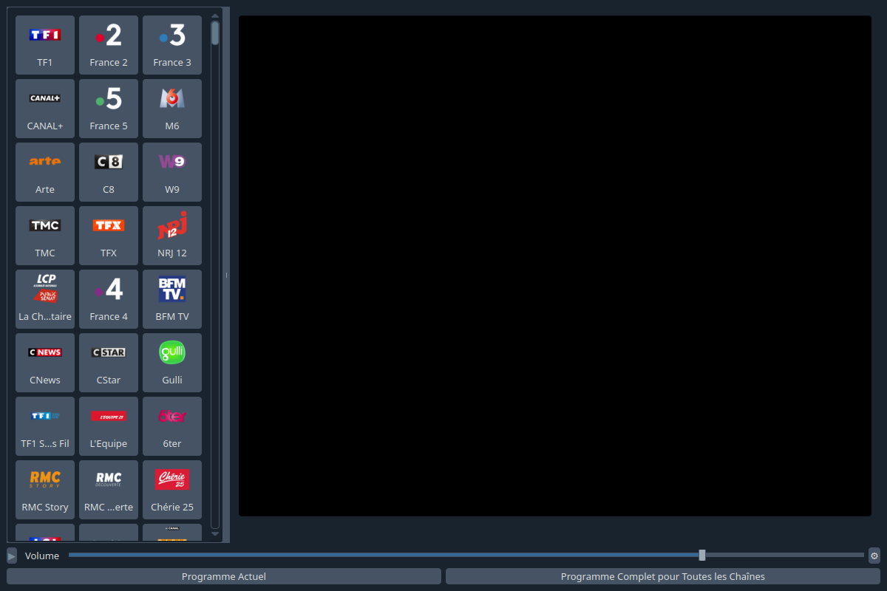
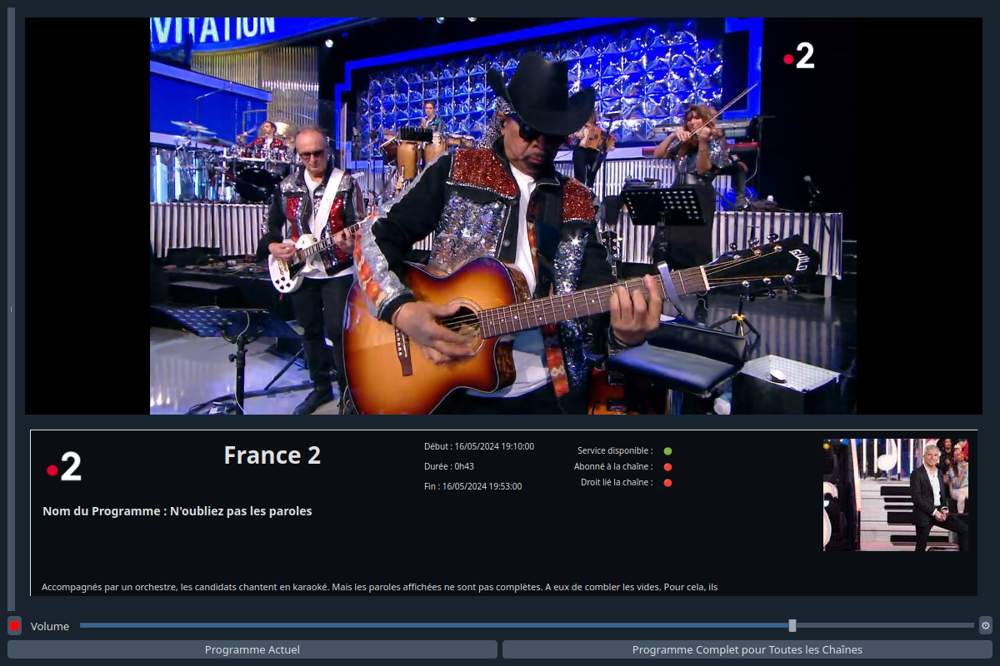
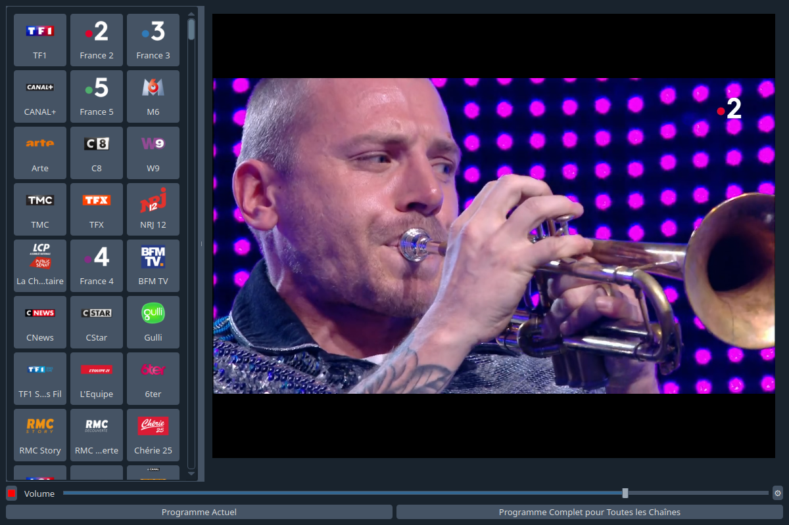
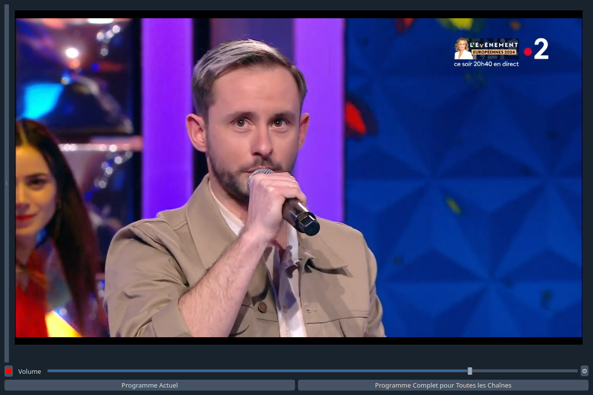
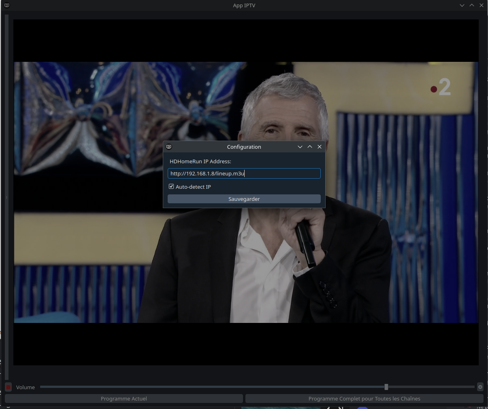
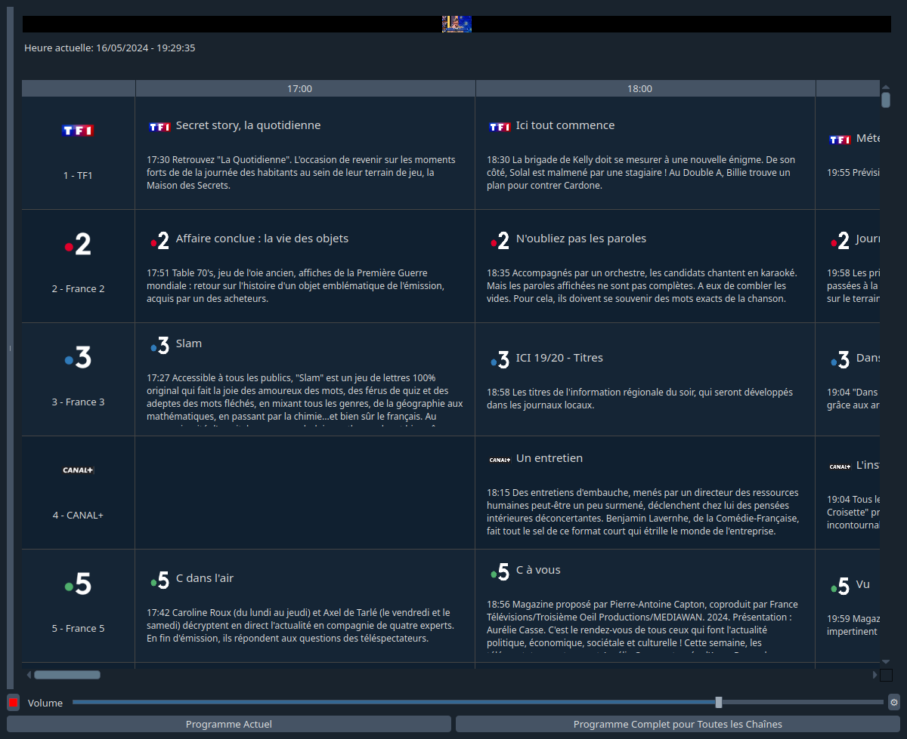

[Pour La Version Française](./README.md)
(Here english version)

# APPIPTV Freebox and HDHomeRun  
  




  
IPTVAPP is an IPTV streaming application with a graphical user interface based on PyQt6, allowing you to watch live TV programs via the VLC media player library in Python.  
  
## Features  
  
- Live TV program viewing.
  
- M3U playlist management.
 
- IP address configuration for HDHomeRun devices.
 
- Program Guide Interface via Free Telecom.
 
- Current Program Information (via Free Telecom).
  
  
## Requirements  
  
### Internet Connection
  
To access most TV channels and the EPG (Electronic Program Guide), an internet connection provided by Free Telecom is necessary. Using this service outside of the Free network may limit access to certain features or channels.
  
### HDHomeRun Devices
  
Using an HDHomeRun device allows access to DVB-T or cable channels, depending on the model you have. However, please note that access to the EPG is limited and may not be available without a connection via Free Telecom. 
  
### Python and Dependencies
  
Ensure you have Python 3.8 or later installed on your machine. You can check your Python version with the following command:  
  
```bash
python --version
```
  
If Python is not installed, you can download and install it from [python.org](https://www.python.org/downloads/).
  
Additionally, the following dependencies are required to run IPTVAPP. They are all available via pip and are listed in the requirements.txt file:   
  
- PyQt6: A set of Python bindings for Qt6 used for the user interface.
- requests: A library for making HTTP requests.
- python-vlc: A library to integrate VLC media player into Python applications.
- pytz: A library for accurate date and time manipulations with timezone support.
  
```plaintext
PyQt6
requests
python-vlc
pytz
qdarkstyle
```
  
## Free Telecom ISP
  
IPTVAPP is designed to work optimally on an internet connection provided by the ISP Free Telecom. Access to TV channels and the EPG is optimized for Free customers and may not function correctly with other internet service providers. If you are not a Free Telecom customer, some features or channels may not be available or may require additional configuration.  
  
## Using HDHomeRun Devices
  
With an HDHomeRun device, you can access DVB-T or cable channels, depending on the model you own. However, it is important to note that without a connection via Free Telecom, access to the Electronic Program Guide (EPG) is not available. HDHomeRun users will need to use alternative solutions to access channel programming information.  
  
## Installation
  
Clone the GitHub repository:  
  
```bash
git clone https://github.com/Bit-Scripts/APPIPTV_Freebox_et_HDHomeRun.git
cd APPIPTV_Freebox_et_HDHomeRun
```
  
## Install the necessary dependencies:
  
```bash
pip install -r requirements.txt
```
  
## Usage
  
To start the application, run:  
  
```bash
python main.py
```
  
## License
  
This project is licensed under the GNU General Public License v3.0. See the [LICENSE.md](./LICENSE.md) file for details.  
  
## Contribution
  
Contributions are highly encouraged and every contribution is appreciated. If you wish to contribute, please refer to the [CONTRIBUTING.md](.github/CONTRIBUTING.md) file for detailed guidelines. 
  
- **Report Bugs**: Use the [issues](https://github.com/Bit-Scripts/APPIPTV_Freebox_et_HDHomeRun/issues) to report bugs.  
- **Propose Features**: You can also propose new features through the [issues](https://github.com/Bit-Scripts/APPIPTV_Freebox_et_HDHomeRun/issues).  
- **Submit Pull Requests** : If you have improved our code or added features, feel free to submit a pull request.   
  
Please refer to the [GitHub contribution guide](https://docs.github.com/en/communities/setting-up-your-project-for-healthy-contributions/setting-guidelines-for-repository-contributors) for more details on how to contribute effectively.