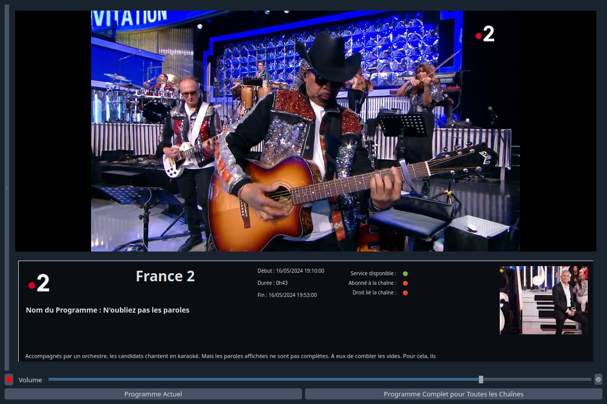
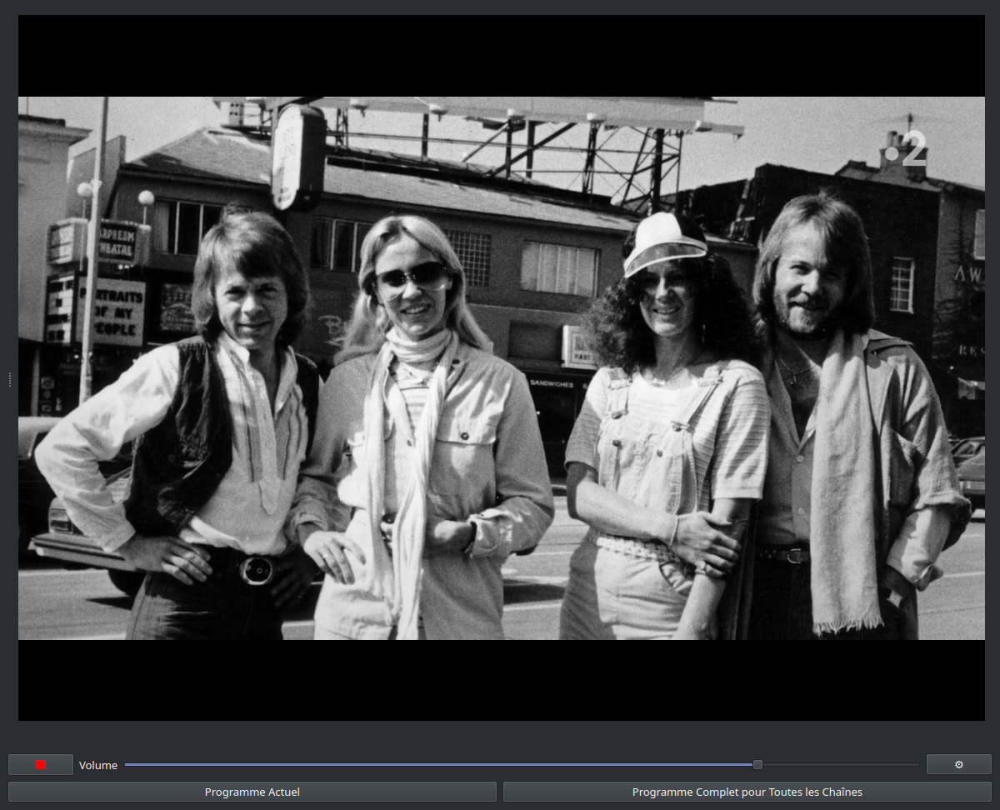
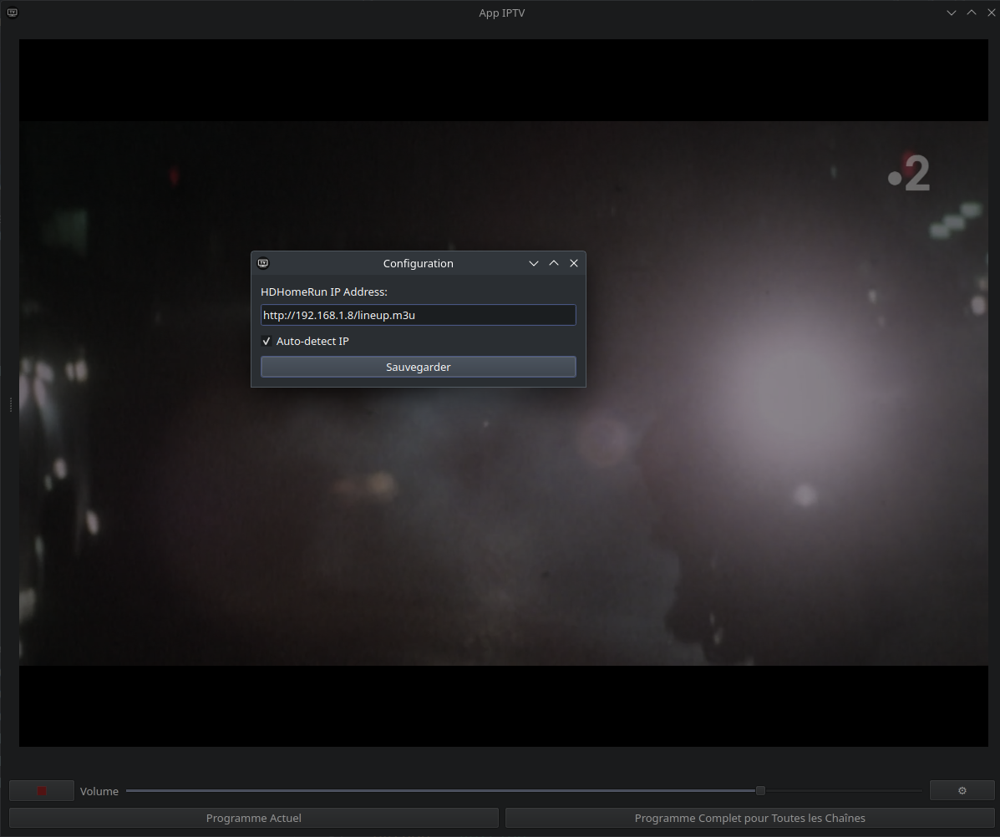
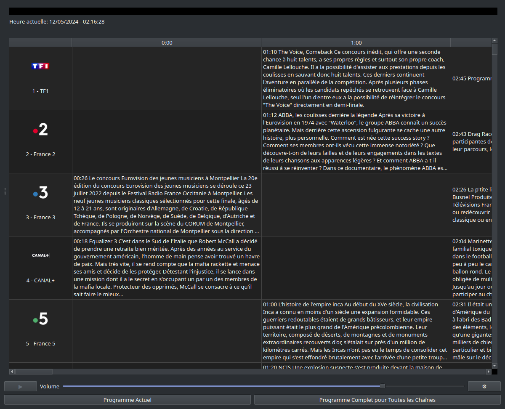

# APPIPTV Freebox et HDHomeRun  
  

  
IPTVAPP est une application de streaming IPTV avec une interface utilisateur graphique basée sur PyQt6, permettant de visualiser des programmes TV en direct via la bibliothèque de VLC media player en Python.  
  
## Fonctionnalités  
  
- Visualisation de programmes TV en direct.
  
- Gestion de playlists M3U.
 
- Configuration des adresses IP pour les dispositifs HDHomeRun.
 
- Interface du Guide des Programmes via Free Télécom.
 
- Informations sur le Programme en Cours (via Free Télécom).
  
  
## Prérequis  
  
### Connexion Internet
  
Pour accéder à la majorité des chaînes TV et à l'EPG (Guide Électronique des Programmes), une connexion internet fournie par le FAI Free Télécom est nécessaire. L'utilisation de ce service hors du réseau de Free peut limiter l'accès à certaines fonctionnalités ou chaînes.
  
### Dispositifs HDHomeRun
  
L'utilisation d'un dispositif HDHomeRun permet l'accès aux chaînes de la TNT ou du câble, selon le modèle que vous possédez. Cependant, veuillez noter que l'accès à l'EPG est limité et peut ne pas être disponible sans une connexion via Free Télécom.  
  
### Python et Dépendance
  
Assurez-vous d'avoir Python 3.8 ou une version ultérieure installée sur votre machine. Vous pouvez vérifier votre version de Python avec la commande suivante :  
  
```bash
python --version
```
  
Si Python n'est pas installé, vous pouvez le télécharger et l'installer à partir de [python.org](https://www.python.org/downloads/).
  
De plus, les dépendances suivantes sont nécessaires pour exécuter IPTVAPP. Elles sont toutes disponibles via pip et sont listées dans le fichier requirements.txt :   
  
- PyQt6 : Un ensemble de liaisons Python pour Qt6 utilisé pour l'interface utilisateur.
- requests : Une bibliothèque pour effectuer des requêtes HTTP.
- python-vlc : Une bibliothèque pour intégrer VLC media player dans des applications Python.
- pytz : Une bibliothèque permettant des manipulations précises de dates et heures avec prise en charge des fuseaux horaires.
  
```plaintext
PyQt6
requests
python-vlc
pytz
```
  
## FAI Free Télécom
  
IPTVAPP est conçu pour fonctionner idéalement sur une connexion internet fournie par le FAI Free Télécom. L'accès aux chaînes TV et à l'EPG est optimisé pour les clients de Free et peut ne pas fonctionner correctement avec d'autres fournisseurs d'accès internet. Si vous n'êtes pas client chez Free Télécom, certaines fonctionnalités ou chaînes peuvent ne pas être disponibles ou requérir des configurations supplémentaires.  
  
## Utilisation des Dispositifs HDHomeRun
  
Avec un dispositif HDHomeRun, vous pouvez accéder aux chaînes de la TNT ou du câble, selon le modèle que vous possédez. Cependant, il est important de noter que sans une connexion via Free Télécom, l'accès au Guide Électronique des Programmes (EPG) n'est pas disponible. Les utilisateurs de HDHomeRun devront donc utiliser des solutions alternatives pour accéder aux informations de programmation des chaînes.  
  
## Installation
  
Clonez le dépôt GitHub :  
  
```bash
git clone git@github.com:Bit-Scripts/APPIPTV_Freebox_et_HDHomeRun.git
cd APPIPTV_Freebox_et_HDHomeRun
```
  
## Installez les dépendances nécessaires :
  
```bash
pip install -r requirements.txt
```
  
## Utilisation
  
Pour démarrer l'application, exécutez :  
  
```bash
python main.py
```
  
## Licence
  
Ce projet est sous licence GNU General Public License v3.0. Voir le fichier [LICENSE.md](./LICENSE.md) pour plus de détails.  
  
## Contribution
  
Les contributions sont vivement encouragées et chaque contribution est appréciée. Si vous souhaitez contribuer, vous pouvez :  
  
- **Rapporter des Bugs** : Utilisez les [issues](https://github.com/Bit-Scripts/APPIPTV_Freebox_et_HDHomeRun/issues) pour signaler des bugs.  
- **Proposer des Fonctionnalités** : Vous pouvez aussi proposer de nouvelles fonctionnalités par le biais des [issues](https://github.com/Bit-Scripts/APPIPTV_Freebox_et_HDHomeRun/issues).  
- **Envoyer des Pull Requests** : Si vous avez amélioré notre code ou ajouté des fonctionnalités, n'hésitez pas à envoyer une pull request.   
  
Veuillez consulter le [guide de contribution de GitHub](https://docs.github.com/fr/communities/setting-up-your-project-for-healthy-contributions/setting-guidelines-for-repository-contributors) pour plus de détails sur comment contribuer efficacement.  